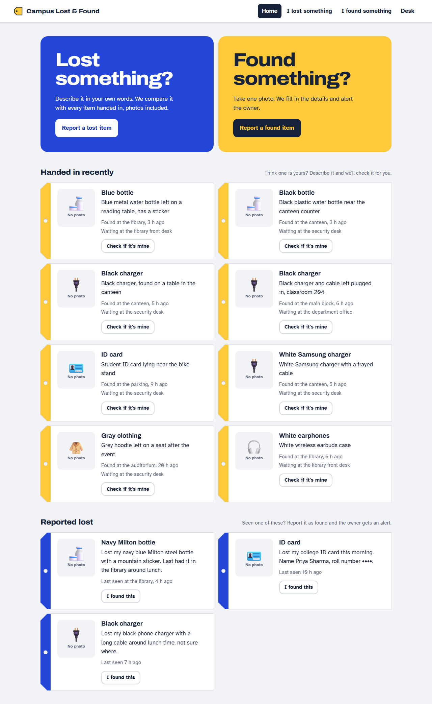
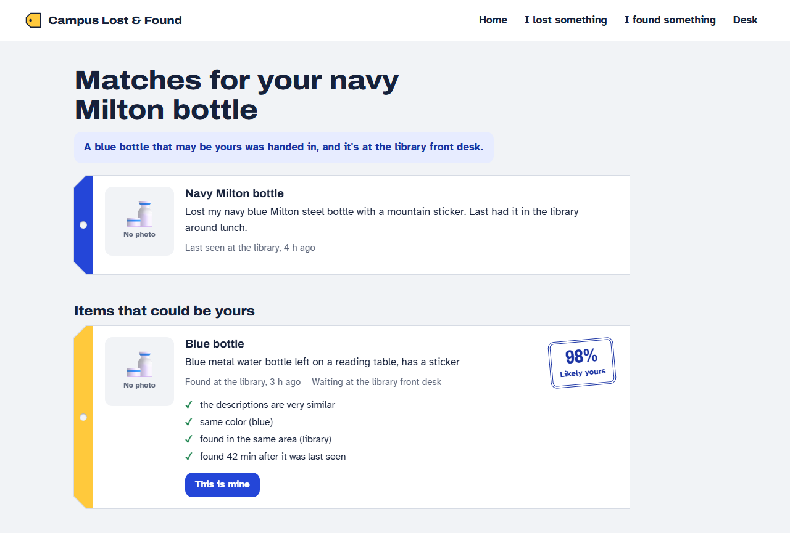
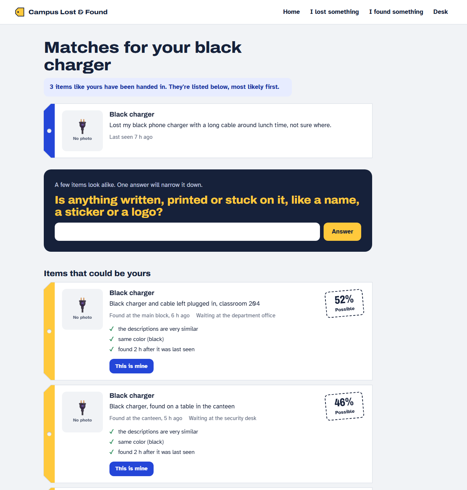
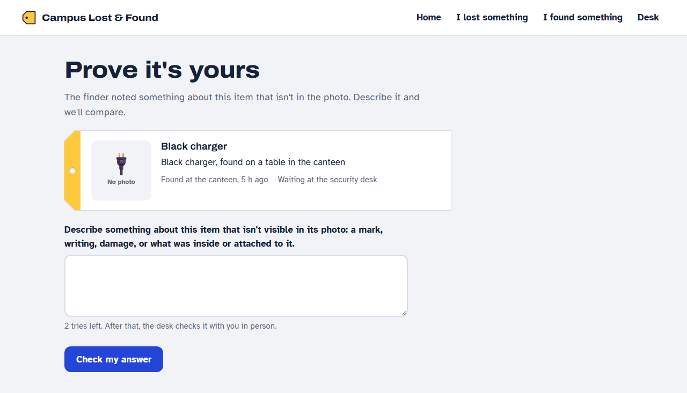
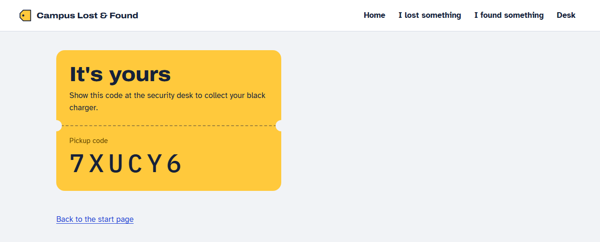
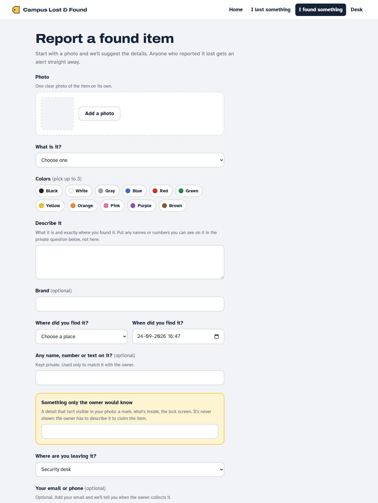
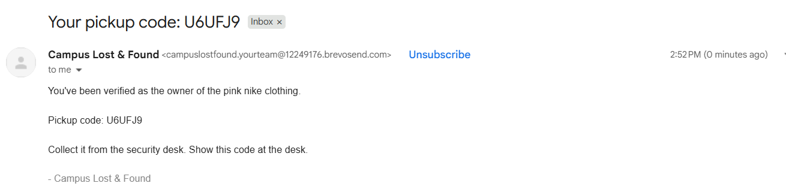
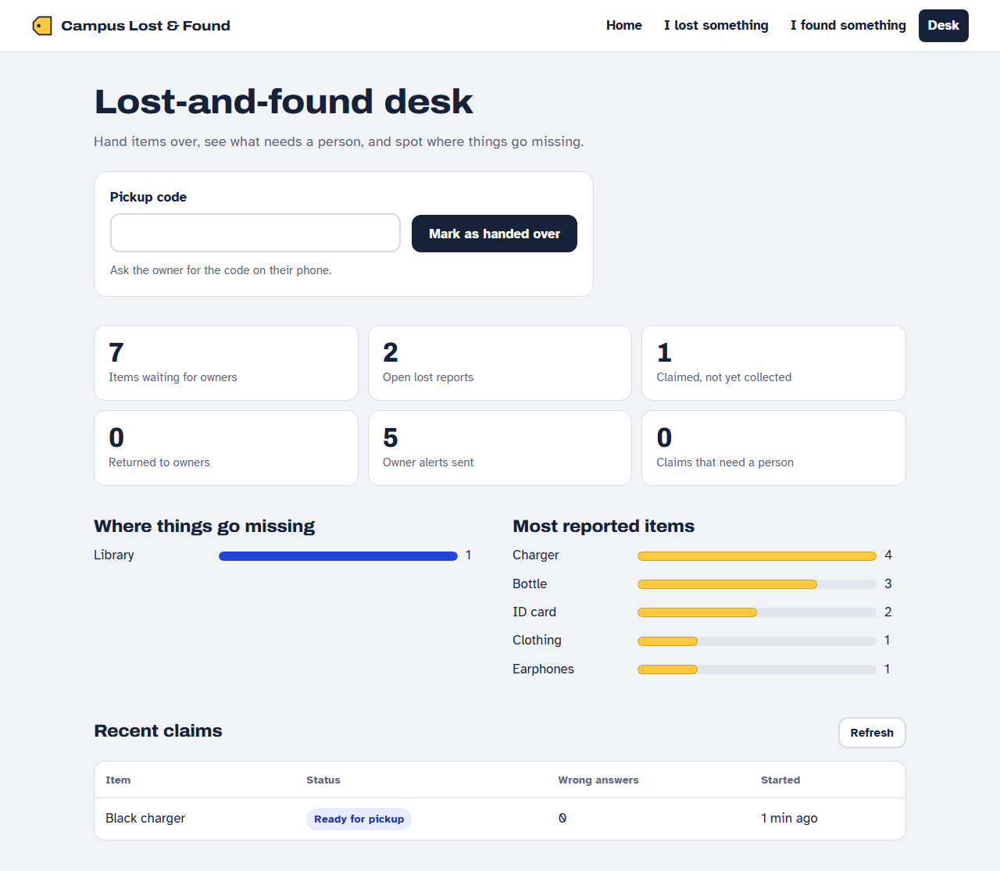

# Campus Lost & Found

**Report a lost or found item in a few seconds. The app matches descriptions and photos, explains each match, asks the one question that settles look-alikes, and checks ownership before anyone collects an item.**

📄 **[Detailed approach and design decisions →](docs/APPROACH.md)**



---

## Contents
- [The problem](#the-problem)
- [What makes it unique](#what-makes-it-unique)
- [Screenshots](#screenshots)
- [Our approach and why we chose it](#our-approach-and-why-we-chose-it)
- [Datasets and models](#datasets-and-models)
- [Results](#results)
- [Setup and running the project](#setup-and-running-the-project)
- [Tech stack and project structure](#tech-stack-and-project-structure)
- [Limitations and next steps](#limitations-and-next-steps)

---

## The problem

On most campuses, lost and found means a WhatsApp group, a cardboard box at the security desk and a lot of luck.

- **Owners and finders describe items differently.** "Navy Milton flask with a mountain sticker" and "blue metal bottle, sticker on it" are the same bottle, but keyword search won't connect them.
- **Owners rarely have a photo** of what they lost. Finders usually have *only* a photo.
- **Anyone can claim anything.** If you can see a photo of a phone, you can describe it well enough to take it home.

## What makes it unique

| | What it does | Why it matters |
|---|---|---|
| 📸 **Photo ↔ description matching** | A finder's **photo** is compared directly with an owner's **written description** (CLIP puts images and text in the same space). | This is the most common real case: the owner has no photo, the finder has nothing else. |
| 🎯 **Smart Claim question** | When several items look alike, the app works out **which single question best separates them** (information gain) and asks only that. Two black chargers? It asks *"Is anything written on it?"*, not *"What colour is it?"* | The owner answers one question instead of scrolling a list, and the answer re-ranks the matches. |
| 🔐 **Ownership proof with a hidden detail** | The finder records a detail that's never shown (a scratch, what's inside). The claimant must describe it to get a pickup code. | Matching alone **never** releases an item, so people can't claim things they only saw in a listing. |
| ⚖️ **Honest confidence** | Confidence is shared across competing candidates **and** the chance the item hasn't been handed in yet. Two identical chargers show ~50% each, not 90% each. | Stops the app confidently pointing to the wrong item. |
| 💬 **Every match explained** | ✓ *same color (blue)* · ✓ *found in the same area* · ✗ *color differs (black vs white)* | People trust reasons, not bare percentages. |
| 🔔 **Two-tier alerts and email across the journey** | *"may be yours"* vs. *"something similar was handed in"*, plus emails for the match, the pickup code, and the hand-over. | Nobody has to keep checking the site, and a white charger is never presented as a lost black one. |
| 🛟 **Works with no AI service at all** | An LLM (Claude or any OpenAI-compatible model) is optional. Every feature has a rule-based fallback. | A rate limit or bad Wi-Fi can't break it. |

## Screenshots

**1. A match found from a description alone.** The owner never had a photo. The lost navy bottle matches the found blue bottle at 98%, with the reasons listed.



**2. Smart Claim.** Two near-identical black chargers are close (52% vs 46%), so the app asks the single most useful question: whether anything is written on it. A white Samsung charger is ranked as unlikely because its colour differs.



**3. Proving ownership.** The claimant must describe the detail the finder recorded but never showed. A correct answer produces a pickup code.

| Ownership question | Verified: pickup code |
|---|---|
|  |  |

**4. Reporting a found item.** Adding a photo fills in the category and colours automatically. The yellow box is the private detail that only the owner would know.



**5. The email the owner receives** (sent through Brevo SMTP).



**6. The staff desk.** Enter the pickup code to hand the item over, and see where things go missing.



## Our approach and why we chose it

> This is a summary. **[docs/APPROACH.md](docs/APPROACH.md)** explains every stage in detail: the exact formulas, thresholds, worked examples, and the alternatives we rejected.

```
 lost report ─┐                                                              ┌─> ranked matches + reasons
              ├─> enrich ─> embed ─> filter ─> 9 signals ─> fuse ─> confidence ┼─> Smart Claim question (if ambiguous)
found report ─┘                                                              └─> owner alerts + email

 claim ─> open question about the finder's hidden detail ─> judge answer ─> pickup code ─> desk hand-over
```

| Stage | What we do | Why we chose it |
|---|---|---|
| **Enrich** | Fill in category, colours, brand and writing: form input first, then text (LLM or keyword rules), then photo (CLIP zero-shot tags, optional OCR). | Finders are in a hurry, so one photo should fill the form. What the person types always wins, because a person looking at the item beats a model looking at a photo. |
| **Embed** | **MiniLM** for full descriptions; **CLIP** for photos and for short captions built from the structured fields. | CLIP is the only practical way to compare a photo with words, but it's weak on long text (77-token limit). MiniLM handles paraphrases well ("flask" ≈ "bottle"). Neither needs training, and **no lost-and-found training data exists**. |
| **Filter** | Drop impossible pairs: different item groups (a bottle is never a laptop), or found before it was lost (with 2 h of slack). | Facts that rule a match out shouldn't be outweighed by similar wording. |
| **Score** | Nine signals from 0 to 1: text, photo, **photo ↔ description**, category, colour, brand, writing on the item, distance, time gap. Each is rescaled to its useful range. **A missing signal counts as unknown, not zero.** | Text embeddings are nearly colour-blind, so colour needs its own signal. Owners without a photo shouldn't be penalised. |
| **Fuse** | Weighted average of the known signals (photo 0.25; text, photo ↔ description and writing 0.20 each; colour 0.15…), then a logistic curve to turn it into a probability. | Transparent, and works with no training data. A logistic-regression **calibrator** that learns the weights from labelled pairs is already built for when real data exists. |
| **Confidence** | `odds_i ÷ (1 + Σ odds)`, which shares confidence across the candidates and the "not handed in yet" option. | Only one candidate can be yours. This keeps look-alikes from each claiming 90%. |
| **Ask** | If the top match is below 75%, pick the attribute (writing, brand, colour, place) with the highest confidence-weighted entropy, discounted by how reliably owners know it. The answer is added to the report and the matches re-rank. | One well-chosen question beats a long list. Questions are open-ended, so they never reveal the answer. |
| **Verify** | The finder's hidden detail. Rules: 50% of its key words must appear in the answer. With an LLM, a pass must also be grounded in the detail, which blocks prompt injection. 2 wrong answers flag the claim for staff. | The finder is the only person who can set a fair test. Strict rules fail safe, and the desk resolves edge cases in person. |
| **Alert** | "May be yours" at 75% or more with no contradiction; "similar" from 40%. Emails at every step, sent in the background. | An owner should hear about a white charger when they lost a black one, but not be told it's theirs. |

**Architecture:** matching runs **in memory** (a campus has hundreds of reports, so ranking takes milliseconds) with **SQLite** for storage. A vector database would add infrastructure with no benefit at this size. **FastAPI** serves the API, photos and the built **React** app from **one Docker container**, so there's one URL and no cross-origin setup.

## Datasets and models

No task-specific training was done: no public dataset of paired lost and found reports exists. We used **pretrained models** zero-shot, and **built our own evaluation and demo data**.

| Data or model | What it is | Link |
|---|---|---|
| **Evaluation set** (ours) | 10 lost reports vs. 22 found reports (12 are deliberate look-alike distractors), with categories, colours, brands, places, time offsets and writing on items. Owner and finder descriptions are written in different styles. | [`backend/eval_sample.csv`](backend/eval_sample.csv) |
| **Demo data** (ours) | 3 lost and 8 found reports that show a clear match, the Smart Claim case (two black chargers) and an ID card match. Loaded through the real API. | [`backend/seed.py`](backend/seed.py) |
| **all-MiniLM-L6-v2** | Sentence-embedding model for descriptions (384 dimensions), trained by sentence-transformers on over 1 billion sentence pairs. | [huggingface.co/sentence-transformers/all-MiniLM-L6-v2](https://huggingface.co/sentence-transformers/all-MiniLM-L6-v2) |
| **CLIP ViT-B/32** | Image and text model trained by OpenAI on 400 million image–caption pairs; used for photos, captions and zero-shot tagging. | [huggingface.co/sentence-transformers/clip-ViT-B-32](https://huggingface.co/sentence-transformers/clip-ViT-B-32) · [paper](https://arxiv.org/abs/2103.00020) |

**Evaluation CSV format:** `item_id, role (lost/found), description, category, colors (a;b), brand, location, hours, photo, text_on_item`. Each real item appears once as `lost` and once as `found` with the same `item_id`; extra `found` rows are distractors. Add a `photo` path to include photo signals.

## Results

Evaluated with `python evaluate.py eval_sample.csv`:

| Configuration | Recall@1 | Recall@3 | MRR |
|---|---|---|---|
| Text similarity only | 0.70 | 0.90 | 0.82 |
| Text + attributes (category, colour, brand, writing) | 0.80 | 1.00 | 0.90 |
| **Full fusion** (+ place and time) | **0.90** | **1.00** | **0.95** |

*Recall@1 = right item ranked first; Recall@3 = in the top three; MRR rewards ranking the right item higher (1.0 = always first).*

Each layer removes ranking mistakes, and full fusion puts the right item first 9 times out of 10. **Honest caveat:** the set is small, has no photos yet, and was written by the same team that designed the signals, so treat these numbers as evidence that the approach works rather than as a benchmark. [APPROACH.md §16](docs/APPROACH.md#16-how-we-evaluated-it) describes how to build a proper held-out set.

In the demo data, a lost navy bottle described **with no photo** matches the right found bottle at **98%**. Two near-identical black chargers start at **52% vs 46%**, and one Smart Claim answer puts the right one on top.

## Setup and running the project

### Prerequisites
- **Python 3.10+**
- **Node.js 20.19+ or 22.12+**
- About **1.5 GB of free RAM** (the two models use about 0.8 GB, peaking at about 1.1 GB during start-up)
- The first start downloads about **700 MB** of models

### 1. Backend

```bash
cd backend
python -m venv .venv
# Windows:        .venv\Scripts\activate
# macOS / Linux:  source .venv/bin/activate
pip install torch --index-url https://download.pytorch.org/whl/cpu   # small CPU-only build (skip on macOS)
pip install -r requirements.txt
uvicorn app:app --port 8000
```

Wait for `Application startup complete`. API docs are at http://localhost:8000/docs.

> **Windows:** if starting fails with `WinError 4551 … Application Control policy has blocked this file` (torch DLL), Windows **Smart App Control** is blocking PyTorch. Turn it off under Windows Security → App & browser control, or run the backend in WSL.

### 2. Demo data (optional, in a second terminal)

```bash
cd backend
python seed.py            # or: python seed.py http://your-host:port
```

It prints the demo links and the correct answers to type. To add photos to the demo, put `L1.jpg`, `F1.jpg`… in `backend/seed_photos/` before running it.

### 3. Frontend (in a third terminal)

```bash
cd frontend
npm install
npm run dev               # http://localhost:5173 (forwards /api to port 8000)
```

### 4. Try the demo flow
1. Open the **Smart Claim** link that `seed.py` printed. Two black chargers are close, and the app asks what's written on the item.
2. Answer `my name ARJUN is on the plug`. The right charger moves to the top.
3. Press **This is mine** and answer `my name is written on the plug in silver marker` to get a pickup code. A vague answer like "it's black" fails.
4. On the **Desk** page, enter the code to hand the item over.

### 5. Measure matching quality

```bash
cd backend
python evaluate.py eval_sample.csv                        # Recall@1, Recall@3, MRR and the ablation table
python evaluate.py my_items.csv --save-calibrator          # learn weights from your own labelled data
```

### Configuration (all optional)

| Variable | Purpose |
|---|---|
| `SMTP_HOST`, `SMTP_PORT`, `SMTP_USER`, `SMTP_PASSWORD`, `MAIL_FROM` | Send real emails (any SMTP provider; e.g. Brevo `smtp-relay.brevo.com`, or Gmail with an App password). Without these, emails are printed to the console. |
| `APP_URL` | Base URL used for links in emails, e.g. `https://your-app.up.railway.app` |
| `DATA_DIR` | Folder for the database and photos (point it at a persistent volume when hosted) |
| `ANTHROPIC_API_KEY` (+ `ANTHROPIC_MODEL`) | Use Claude for text extraction, tailored ownership questions and answer judging |
| `LLM_BASE_URL`, `LLM_MODEL`, `LLM_API_KEY` | Use any OpenAI-compatible endpoint instead, e.g. a local Ollama server at `http://localhost:11434/v1` |
| `REMOVE_BG=1` | Remove photo backgrounds before CLIP (needs `pip install rembg`) |
| `VITE_API_URL` | Frontend only: point at an API hosted elsewhere |

Optional extra: `pip install easyocr` reads names and numbers written on found items automatically.

### Run with Docker

```bash
docker build -t lostfound .
docker run -p 7860:7860 lostfound            # http://localhost:7860 (API, photos and frontend together)
```

### Deploy on Railway

1. **New Project → Deploy from GitHub repo.** Railway builds the `Dockerfile`; `railway.json` makes it wait until the models have loaded.
2. Add a **Volume** mounted at `/data`, and set `DATA_DIR=/data`.
3. Add the email variables above, then **Settings → Networking → Generate Domain**, and set `APP_URL` to that domain.
4. Load demo data with `python backend/seed.py https://your-domain`.

The app needs about 1.2 GB of RAM, so free 512 MB tiers are too small.

## Tech stack and project structure

| Layer | Tools |
|---|---|
| Frontend | React 19, Vite, React Router. Plain CSS, no UI framework |
| Backend | FastAPI, SQLite (vectors stored alongside reports) |
| Matching | sentence-transformers (MiniLM, CLIP), NumPy, rapidfuzz, scikit-learn (optional calibrator) |
| Optional AI | Claude or any OpenAI-compatible LLM; easyocr; rembg |
| Email | Python `smtplib` over any SMTP provider (Brevo in our deployment) |
| Deployment | One Docker container on Railway with a persistent volume |

```
backend/
  app.py          API: reports, matching, alerts, Smart Claim, claims, pickups, desk stats
  matcher.py      matching engine: embeddings, filters, signals, fusion, confidence, reasons, question choice
  enrich.py       field extraction (LLM or rules), CLIP photo tags, OCR, answer parsing
  verify.py       ownership question and answer judging
  notify.py       email notifications across the claim lifecycle
  llm.py          optional LLM client with graceful fallback
  db.py           SQLite storage
  seed.py         demo data through the real API
  evaluate.py     Recall@K / MRR / ablation, calibrator training
  eval_sample.csv evaluation dataset
frontend/src/
  pages/          Home, ReportForm (lost + found), ReportPage (matches), ClaimPage, Desk
  components/     TagCard, Stamp, ColorPicker, PhotoPicker
docs/
  APPROACH.md     detailed approach and design decisions
  screenshots/
Dockerfile, railway.json
```

## Limitations and next steps

- **Weights are hand-set.** Train the built-in calibrator on a real, photographed dataset.
- **No accounts yet.** "Your reports" is stored in the browser, and the desk page is open. Add campus sign-on and a staff role.
- **The rule-based ownership check is strict.** Enable the LLM judge, which is already built and protected against prompt injection.
- **Campus geography is approximate.** Use real walking distances between buildings.
- **More channels:** SMS or Telegram alongside email, and a daily digest for the desk.
- **Privacy:** blur ID cards and faces in photos before listing.

**On novelty:** text embeddings, CLIP, weighted fusion and entropy-based question selection are well-established techniques. Our contribution is combining them for lost and found: **match a finder's photo with an owner's words, stay honest when items look alike, ask the one question that settles it, and never hand over an item on a match alone.**
